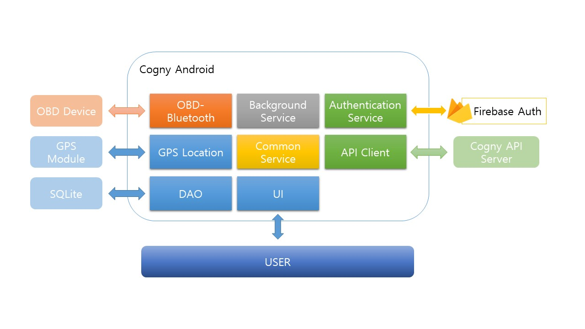

# ⛔️ DEPRECATED
This repository is now deprecated. 

# Cogny
OBDII를 장치를 이용한 자동차 고장진단 서비스.

## Service Overview
1. OBDII를 장치를 이용하여 차량에서 데이터 센싱.
2. BLE통신을 이용하여 안드로이드 앱으로 데이터 1차 수집.
3. 1차 수집된 데이터는 분석서버로 전송.
4. 분석결과 활용.

